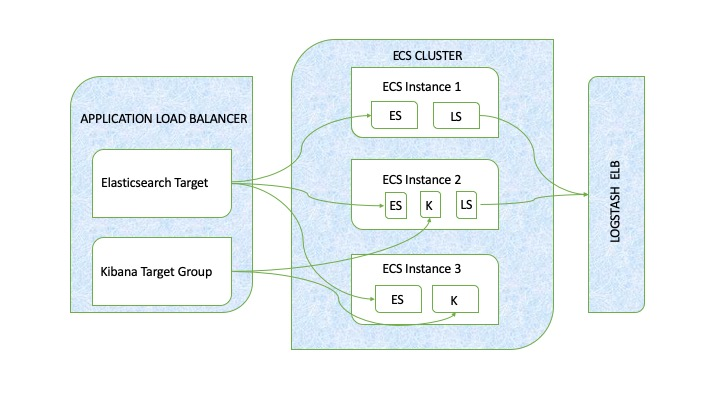

# ELK-stack-on-AWS-ECS
 Deploying Elastic Stack on AWS Elastic Container Service

I will outline the procedure I followed to deploy Elastic Stack on AWS ECS.

> Here is the architecture I followed to build this



In the diagram above, we have the following containers:
- Three ElasticSearch containers to ensure high availability. Odd number to minimize split brain scenarios.
- Two Kibana containers for UI
- Two logstash containers to handle traffic


>[**Split Brain Scenario**](https://scalac.io/split-brain-scenarios-with-akka-scala/#targetText=A%20network%20partition%20membership%20data%20of%20the%20cluster) is a situation where a network failure caused the network to split. The split means that the parts can no longer communicate with each other. They need to decide what to do next on their own based on the latest membership data of the cluster. This is being handled by using 3 ECS clusters. 


*Working with immutable infrastructure to replace defective componenets of this architecture.*

After adding DockerFile and elasticsearch.yml configuration files, run the aws-ecr-bake-and-push.sh file to push a new docker image into the private docker repo. 
```
./aws-ecr-bake-and-push.sh elasticsearch
```

After we have the customized docker image with elasticsearch on ECR, we need to create a cluster in ECS with 3 EC2 instances. 

Few points that need to be addressed:
- We might not need all 3 instances all the time. For this reason, we will be using Autoscaling to start with 1 instance and scale to 3 whenever needed. 
- There is no way to disable public IP assignments from the ECS wizard. Instead, we need to manually ensure our private cluster stays private, safely tucked inside our VPC. 
- ElasticSearch will fail due to a low mmap count; we need to increase that.
- We need to allocate more space to our ElasticSearch nodes than the standard 8GB granted by Amazon.
- We need to customize the docker daemon to take advantage of the extra space.


|**Cluster** | **dev-elk-cluster** |
| --- | --- |
| Instance type | t2.micro | 
| Desired number of instances | 3 |
Key pair | elk-stack
ECS AMI ID|ami-066ce9bb9f4cbb03d
VPC|vpc-071e76a617d759d04
Subnet 1|subnet-02f18e573300175b6
Subnet 1 route table association|rtbassoc-06119201929019675
Subnet 2|subnet-0b8babda5dab2c0b7
Subnet 2 route table association|rtbassoc-0881ec1492ec2c853
VPC Availability Zones|us-east-1a, us-east-1b, us-east-1c, us-east-1d, us-east-1e, us-east-1f
Security group|sg-0cfae2130059a5738
Internet gateway|igw-0a96cb67118059687
Route table|rtb-0de91746702e12029
Amazon EC2 route|EC2Co-Publi-VF872SCT2020
Virtual private gateway attachment|EC2Co-Attac-17Z48YC2S8CVW
Launch configuration|EC2ContainerService-dev-elk-cluster-EcsInstanceLc-154J2FEYWM6UX
| Auto Scaling group |EC2ContainerService-dev-elk-cluster-EcsInstanceAsg-1OEDR2NDUIUHE |
---

Adding the following content to User Data section of the EC2 instances in CloudFormation Changeset.
```
Content-Type: multipart/mixed; boundary="==BOUNDARY=="
MIME-Version: 1.0

--==BOUNDARY==
Content-Type: text/cloud-boothook; charset="us-ascii"

# Set Docker daemon options
cloud-init-per once docker_options echo 'OPTIONS="${OPTIONS} --storage-opt dm.basesize=250G"' >> /etc/sysconfig/docker

--==BOUNDARY==
Content-Type: text/x-shellscript; charset="us-ascii"

#!/bin/bash
echo ECS_CLUSTER=dev-elk-cluster >> /etc/ecs/ecs.config;
echo ECS_BACKEND_HOST=dev-elk-cluster >> /etc/ecs/ecs.config;
echo ECS_ENGINE_TASK_CLEANUP_WAIT_DURATION=15m >> /etc/ecs/ecs.config;
echo ECS_IMAGE_CLEANUP_INTERVAL=10m >> /etc/ecs/ecs.config;
sysctl -w vm.max_map_count=262144;
mkdir -p /usr/share/elasticsearch/data/;
chown -R 1000.1000 /usr/share/elasticsearch/data/;

--==BOUNDARY==--
```

**Storage**

Adding EBS stores for storage and using PIOPS as advised on elastic's documentation. Or we can go with using Instance Store that has the advantage of hard disk physical attached to the host and also benefit of avoiding to pay extra for EBS. 

**Note:** EBS Storage option in ECS Cluster configuration is not the storage for containers to store their data. This volume is strictly for docker images. 

Amazon explains this:
> The volume is configured as a Logical Volume Management (LVM) device and it is accessed directly by Docker via the devicemapper backend. Because the volume is not mounted, you cannot use standard storage information commands (such as df -h) to determine the available storage.

**AutoScaling**

We will be using Autoscaling to scale up or down the EC2 instances as required. [Autoscaling Launch config](AutoScalingLaunchConfig.txt) can be used as reference. 

